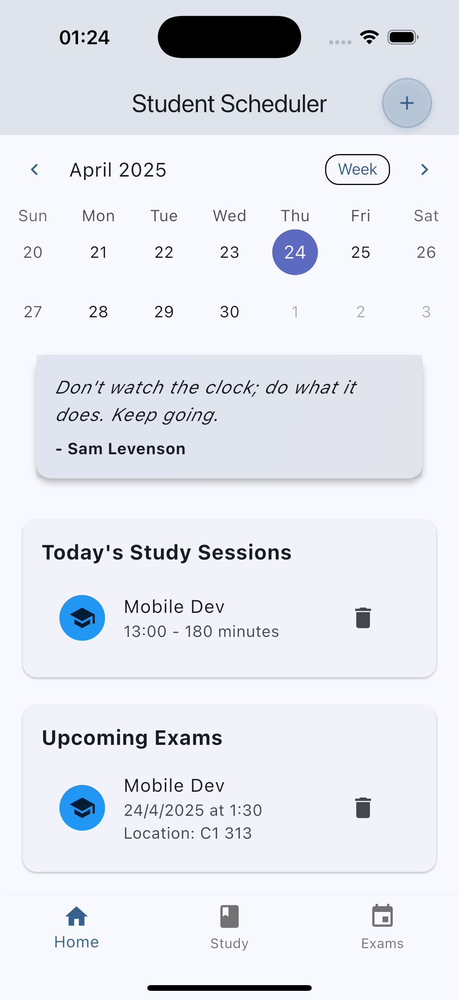
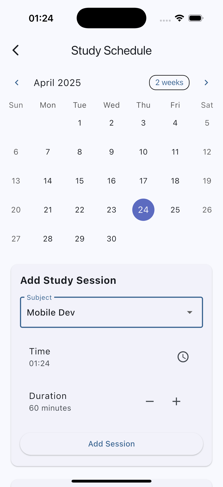
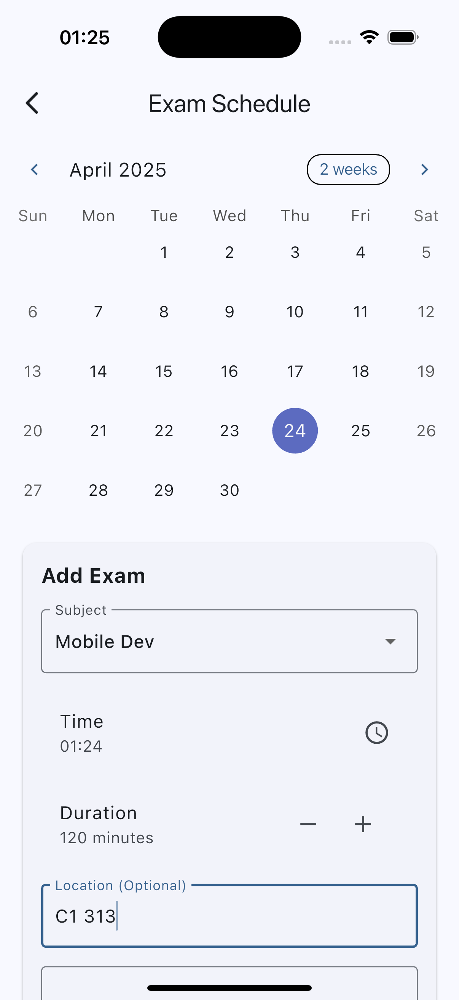
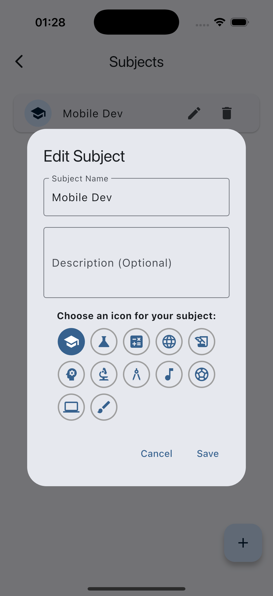

**Full Name:** Sai Seng Main  
**Student ID:** 6631503085  
**App Name:** Student Scheduler  
**Framework Used:** Flutter  
**GitHub Repository Link:** [https://github.com/SAISENGMAIN6631503085/student_scheduler](https://github.com/SAISENGMAIN6631503085/student_scheduler)  

---

### 1. App Concept and Design (2 pts)

**1.1 Target Users**

**Primary Target Users:**
- University students (18-24 years old)
  - Need to manage multiple class schedules
  - Require reminders for assignments and exams
  - Want to track study progress
  - Need help organizing daily academic tasks

**Secondary Target Users:**
- High school students (15-18 years old)
  - Need basic schedule management
  - Want to track homework and test dates
  - Looking for study time organization
  - Need help with academic planning

**1.2 App Goals**

- Help students manage their class schedules efficiently  
- Provide timely reminders for assignments and exams  
- Offer a clean, intuitive interface for schedule management  
- Enable easy tracking of academic tasks and deadlines

**1.3 Mockups**

The app consists of three main screens:
1. Dashboard - Overview of daily schedule and upcoming tasks
2. Schedule Management - Add and edit class schedules
3. Task Tracker - Manage assignments and set reminders

**1.4 User Flow**

Open app > View Home Screen > Navigate to Subjects/Study Schedule/Exam Schedule > Add/Edit Items > Set Study Sessions > Track Progress

---

### 2. App Implementation (4 pts)

**2.1 Development Details**

**Tools Used:**

- Flutter 3.19  
- Dart 3.2  
- Packages: Provider, SharedPreferences, Flutter Local Notifications

**2.2 Features Implemented**

**Checklist:**

- [x] Create and manage class schedules  
- [x] Set reminders for assignments and exams  
- [x] Track task completion status  
- [x] Daily schedule overview
- [ ] Cloud sync (Future implementation)

**2.3 App Screenshots**

  <h3>Main App Screens</h3>
  
  <table>
    <tr>
      <td align="center">
        <b>Home Screen</b> 
        
         
        <i>Calendar view with daily study sessions and upcoming exams</i>
      </td>
      <td align="center">
        <b>Study Schedule</b> 
        
         
        <i>Plan and manage your study sessions</i>
      </td>
    </tr>
    <tr>
      <td align="center">
        <b>Exam Schedule</b> 
        
         
        <i>Track upcoming exams and set reminders</i>
      </td>
      <td align="center">
        <b>Subjects</b> 
        
         
        <i>Manage your subjects with icons</i>
      </td>
    </tr>
  </table>

---

### 3. Deployment (2 pts)

**3.1 Build Type**

[x] Debug  
[ ] Release

**3.2 Platform Tested**

[x] Android  
[x] iOS

**3.3 README & Installation Guide**

To install and run the app:

1. Clone the repository
2. Run `flutter pub get` to install dependencies
3. Connect a device or start an emulator
4. Run `flutter run` to launch the app

---

### 4. Reflection (2 pts)

**Development Experience:**

- Learned effective state management using Provider
- Implemented local notifications for reminders
- Gained experience with Flutter's widget system
- Improved understanding of async operations in Flutter

**Future Improvements:**

- Add cloud synchronization
- Implement user authentication
- Add data backup functionality
- Enhance UI with more customization options

---

### 5. AI-Assisted Development (Bonus)

**5.1 Idea Generation**

Used AI to:
- Refine the app concept
- Generate user personas
- Identify key features

**5.2 UI Design**

AI assistance with:
- Layout structure
- Color scheme suggestions
- Widget organization

**5.3 Code Writing**

AI helped with:
- State management implementation
- Local notification setup
- Database structure

**5.4 Debugging Help**

AI assisted in resolving:
- State management issues
- Notification permission handling
- Widget lifecycle management

**5.5 Deployment Help**

AI provided guidance on:
- Flutter build process
- Platform-specific configurations
- Release preparation

